# event_reward

이벤트/보상 관리 플랫폼입니다.

## 목차

- [실행](#실행)
  - [service 설명](#service-설명)
- [기술스택](#기술스택)
- [신경 쓴 부분](#신경-쓴-부분)
  - [어려웠던 부분](#어려웠던-부분)
  - [조건 검증 방식](#조건-검증-방식)
- [Workflow](#workflow)
  - [Guard](#guard)
    - [Auth Guard](#auth-guard)
    - [Role Guard](#role-guard)
  - [User Context](#user-context)
    - [User 등록 (public)](#user-등록-public)
    - [로그인 (public)](#로그인-public)
    - [user role 변경 (private)](#user-role-변경-private)
  - [Event Context](#event-context)
    - [event 등록 (private)](#event-등록-private)
    - [이벤트 조회 (private)](#이벤트-조회-private)
    - [이벤트 시작 - 수동 (private)](#이벤트-시작---수동-private)
    - [이벤트 시작 - 자동](#이벤트-시작---자동)
  - [Reward Context](#reward-context)
    - [보상 등록 (private)](#보상-등록-private)
    - [보상 조회 (private)](#보상-조회-private)
  - [Reward-Request Context](#reward-request-context)
    - [보상 요청 등록 (private)](#보상-요청-등록-private)
    - [보상 요청 조회 (private)](#보상-요청-조회-private)
    - [보상 요청 승인 (private)](#보상-요청-승인-private)
    - [보상 요청 거절 (private)](#보상-요청-거절-private)
  - [Activity Context](#activity-context)
    - [출석 이벤트 참여 활동 기록](#출석-이벤트-참여-활동-기록)

## 실행

```bash
docker compose up [실행 할 service 이름(전부 실행할 것이라면 입력하지 않아도 된다.)]
```

### service 설명

- auth-db: MongoDB auth server 전용 데이터베이스 (27017 포트)
- event-db: MongoDB event server 전용 데이터베이스 (27018 포트)
- auth-server: 인증 서버 (4040 포트)
- event-server: 이벤트 서버 (4041 포트)
- gateway-server: API 게이트웨이 (4042 포트)
- kafka: 메시지 브로커 (9092 포트)
- kafka-init: Kafka 토픽 초기화
- kafka-ui: Kafka 관리 UI (28989 포트)

## 기술스택

| 항목      | 버전/도구               |
| --------- | ----------------------- |
| Node.js   | 18 (고정)               |
| NestJS    | 최신                    |
| DB        | MongoDB                 |
| 인증      | JWT                     |
| 배포/실행 | Docker + docker-compose |
| 언어      | TypeScript              |
| 이벤트    | Kafka                   |

## 신경 쓴 부분

전체적으로 개발 생산성에 초점을 맞춰서 개발했습니다.

- 로컬에서 처음 시작할 때 docker compose 명령어 하나만으로 실행 할 수 있도록 했습니다.
- 폴더구조에서 어그리거트 별로 수직분할 후 다시 레이어별로 수평분할 하여 도메인별로 작업하기 쉽도록 했습니다.
- 최대한 흐름이 자연스럽게 하여 도메인 flow대로 실행될 수 있도록 했습니다.
- 확장성 있는 설계구조를 가져가보고자 했습니다.
- Domain Driven Design을 적용하여 설계단부터 도메인을 나누고 개발생산성을 올리도록 했습니다.

### 어려웠던 부분

MSA를 처음 설계해 봐서 서로 의존성을 최대한 없게 가져가 single point failure를 없앨 수 있도록 하는것이 어려웠던 것 같습니다.
그래서 gateway server에서 라우팅을 하고 auth-server와 event-server는 서로 호출하지 않도록 하여 결합도를 최대한 낮춰보려고 했습니다. (kafka event 사용)

### 조건 검증 방식

조건 검증 방식은 테스트코드와 postman을 이용한 호출이었습니다.

## Workflow

### Guard

#### Auth Guard

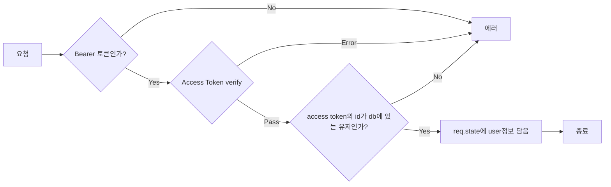

#### Role Guard

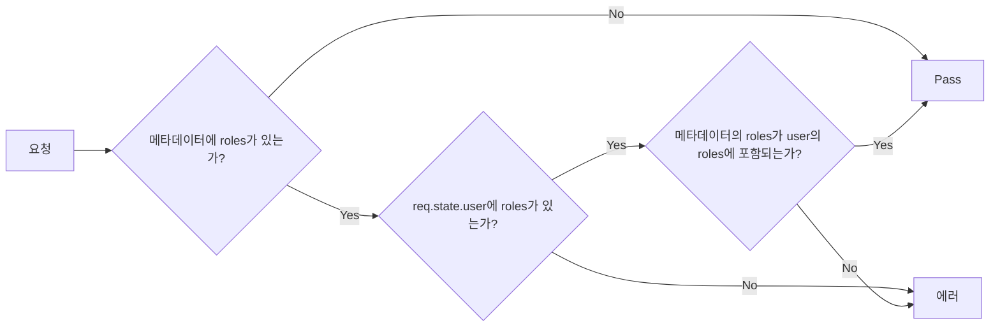

### User Context

#### User 등록 (public)

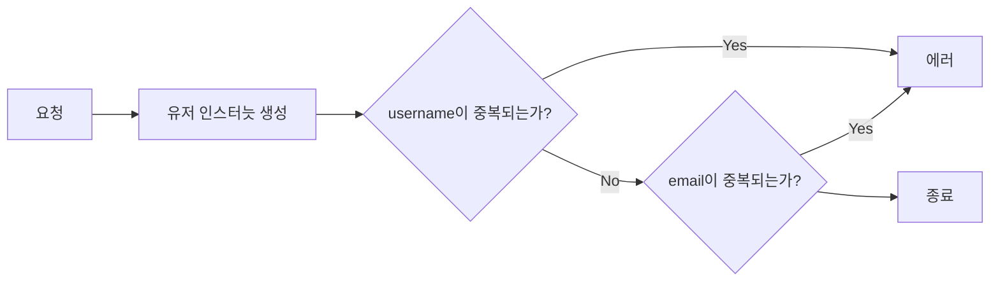

#### 로그인 (public)

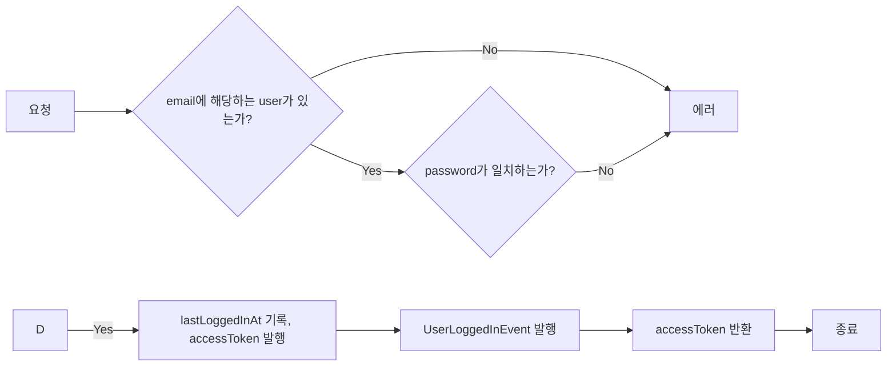

#### user role 변경 (private)

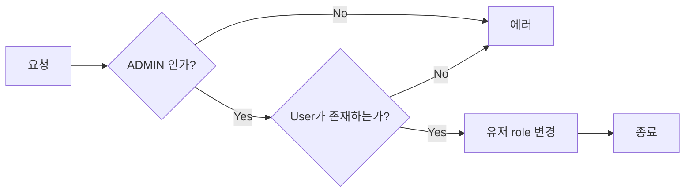

### Event context

#### event 등록 (private)

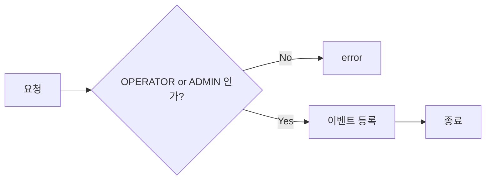

#### 이벤트 조회 (private)

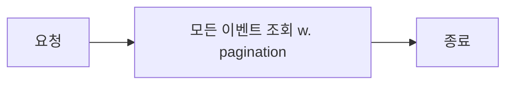

#### 이벤트 시작 - 수동 (private)

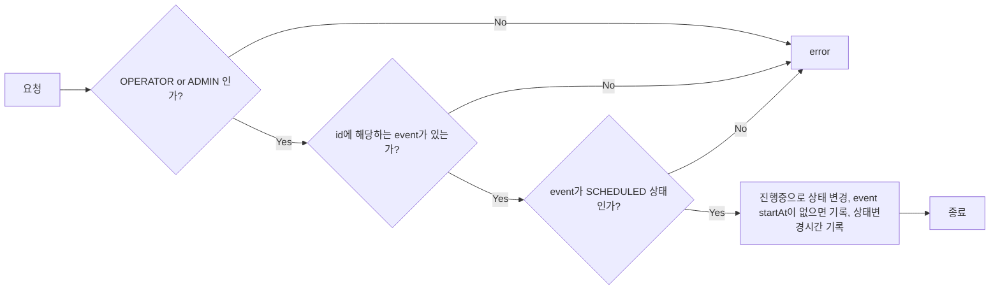

#### 이벤트 시작 - 자동

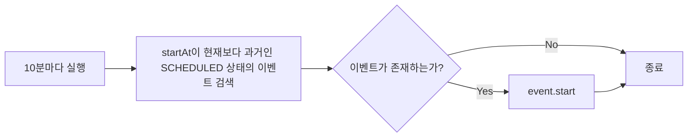

### Reward context

#### 보상 등록 (private)

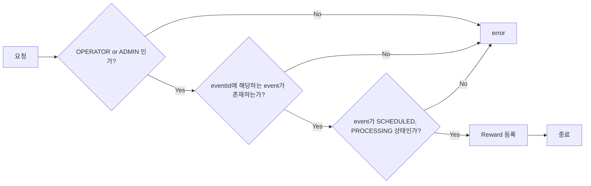

#### 보상 조회 (private)

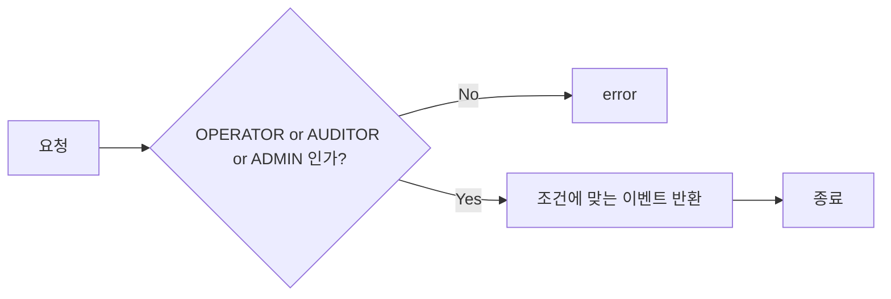

### Reward-Request context

#### 보상 요청 등록 (private)

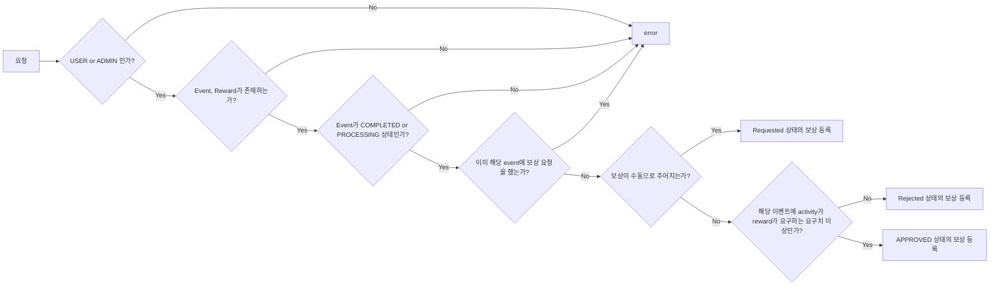

#### 보상 요청 조회 (private)

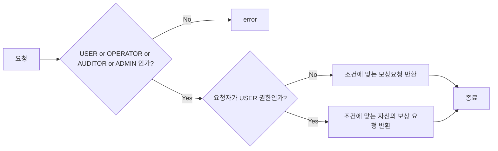

#### 보상 요청 승인 (private)

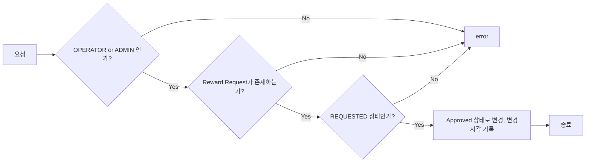

#### 보상 요청 거절 (private)

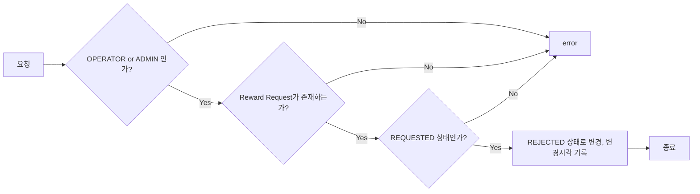

### Activity context

#### 출석 이벤트 참여 활동 기록

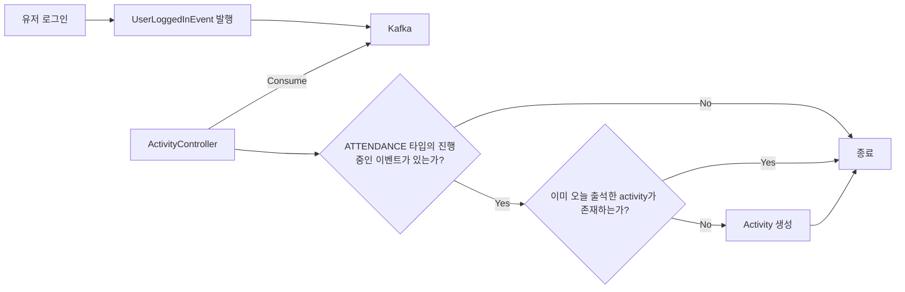
