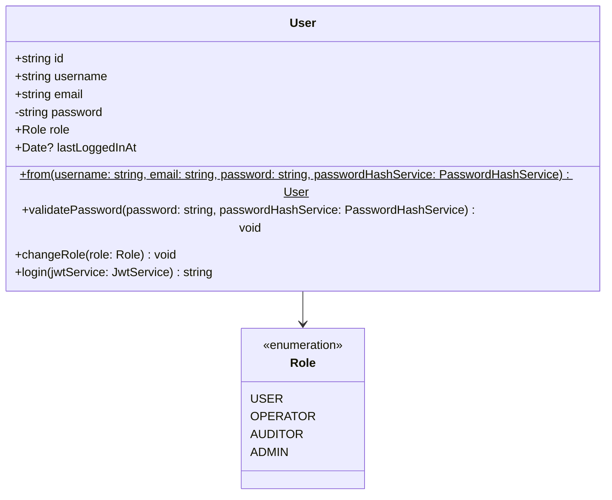

# Auth Server

Auth Server는 유저, 역할과 관련되어있는 서버입니다.

## 주요 기능

- 유저 관리
  - 유저 등록
  - 유저 역할 관리
- 로그인

## 프로젝트 구조

```
src/
├── libs/ # 공통 라이브러리
├── services/ # 서비스 모듈
├── test/ # 테스트 파일
├── app.module.ts # 루트 모듈
└── main.ts # 애플리케이션 엔트리 포인트
```

## 모델

### User


